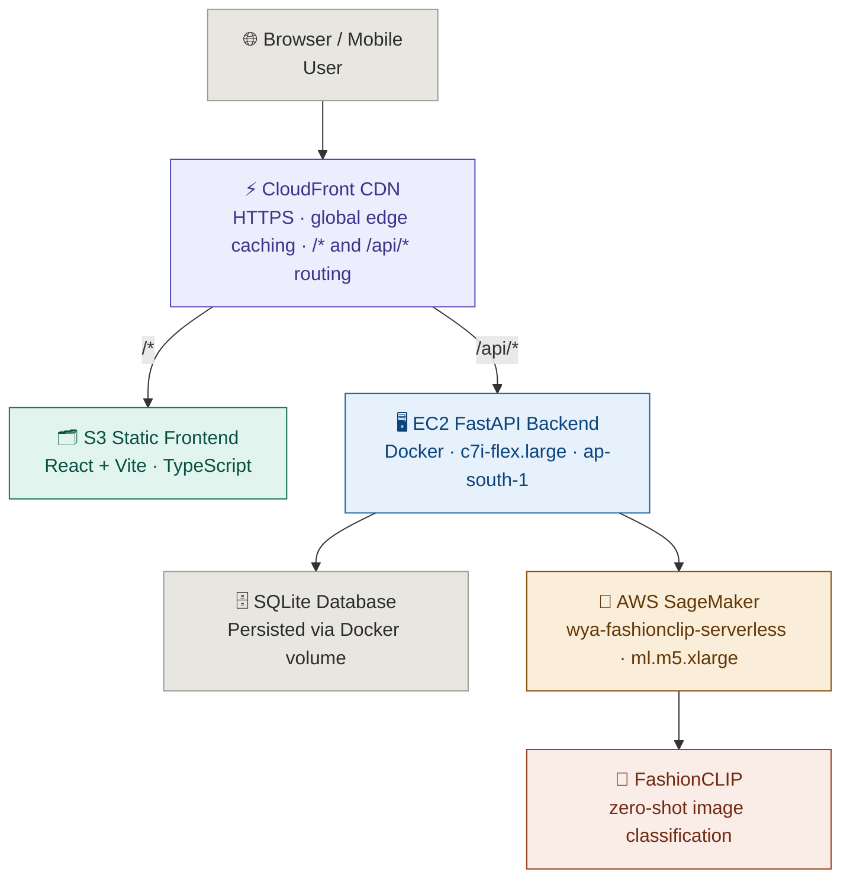
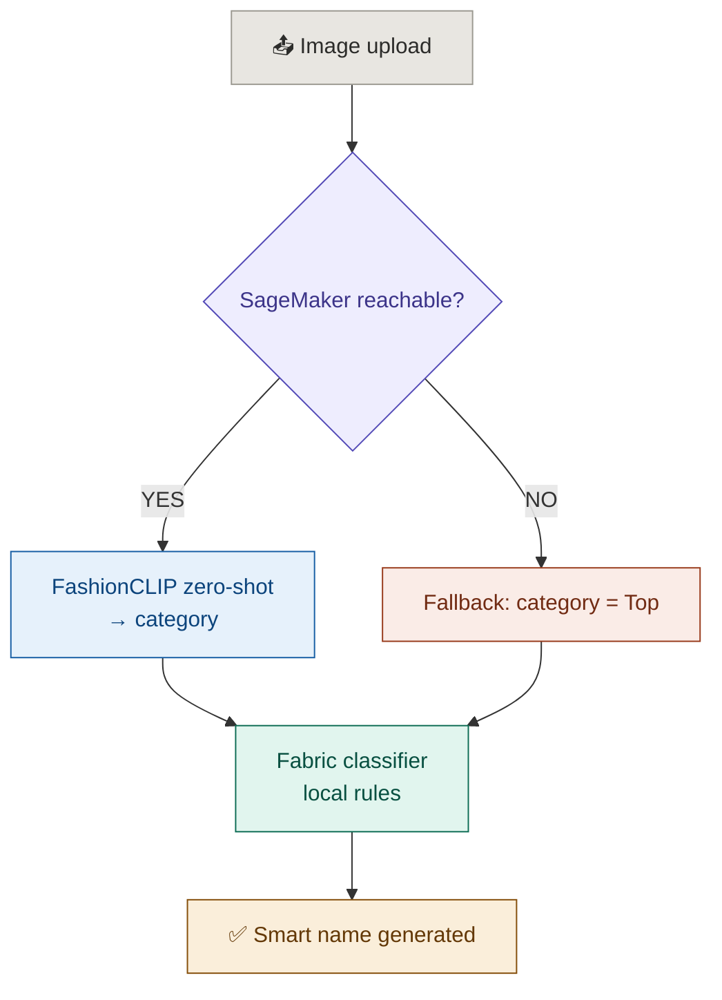

<div align="center">


# WYA — What's Your Aesthetic

**An AI-powered full-stack fashion web app** that helps users discover, analyze, and refine their personal style through computer vision, style profiling, and wardrobe intelligence.

🔗 **Live:** [dsbml6kwxecah.cloudfront.net](https://dsbml6kwxecah.cloudfront.net)

</div>

---

## Architecture



**Deployment**
- Frontend → S3 + CloudFront (HTTPS, CDN cached, global)
- Backend → Docker on EC2 `c7i-flex.large` (ap-south-1), Elastic IP `65.1.104.57`
- CI/CD → GitHub Actions (push to `main` → auto build + deploy + CloudFront invalidation)

---

## Features

| Feature | Description |
|---|---|
| 🧬 Style DNA Quiz | Interactive questionnaire that maps your personal aesthetic |
| 👗 Wardrobe / Closet | Upload garments with AI auto-tagging (category, color, fabric, pattern) |
| 🤖 AI Outfit Matcher | Outfit suggestions based on color harmony and your style profile |
| 📈 Style Evolution | Track how your aesthetic changes over time |
| 🌿 Green Score | Sustainability rating for your wardrobe |
| ✨ Aesthetic Aura | Shareable style card generated from your wardrobe |
| ✈️ Vacation Packer | Trip and weather-based outfit curation |
| 🌤️ Weather Styling | Real-time weather-based outfit recommendations |
| 🪄 Background Removal | Clean garment images automatically via `rembg` |
| 🔔 Push Notifications | Style alerts and reminders via VAPID |

---

## AI Pipeline

```
Image upload
  ↓
Background removal  (rembg + OpenCV)
  ↓
Garment mask extraction  (GrabCut / Otsu thresholding)
  ↓
Garment crop + zoom  (removes background noise pre-classification)
  ↓
✅ Zero-shot classification  →  AWS SageMaker (FashionCLIP)
✅ Dominant color extraction  →  KMeans clustering (sklearn)
✅ Secondary color detection  →  largest non-dominant cluster
✅ Texture + brightness analysis  →  OpenCV
✅ Pattern detection  →  striped / floral / geometric / solid (Sobel + Canny)
✅ Fabric inference  →  rule-based classifier (category × color × texture × pattern)
✅ Smart name generation  →  e.g. "Floral Chiffon Midi Dress", "Washed Indigo Jeans"
✅ Style profile vectorization + outfit similarity matching
```

### Garment Auto-Tagging — Two-Tier Architecture

**Tier 1 — AWS SageMaker (FashionCLIP)**
Zero-shot classification with candidate labels. EC2 authenticates via IAM instance profile (no API keys). Returns category (e.g. Dress, Jeans, Watch).

**Tier 2 — Rule-based fabric classifier**
Runs locally on the EC2 container using `category × color × texture × pattern` rules — no additional ML inference needed.



---

## Tech Stack

**Frontend**
- React + TypeScript + Vite
- Deployed on AWS S3 + CloudFront (HTTPS)

**Backend**
- FastAPI (Python)
- SQLite (persisted at `/app/data/wya.db` via Docker volume)
- OpenCV + Pillow + `rembg` for computer vision
- scikit-learn for KMeans color clustering
- slowapi for per-route rate limiting on AI endpoints
- AWS SageMaker for garment classification (FashionCLIP)
- Dockerized, deployed on AWS EC2 (ap-south-1)

**AWS Infrastructure**
- EC2 `c7i-flex.large` (ap-south-1) — Docker backend, Elastic IP `65.1.104.57`
- S3 + CloudFront — static frontend with HTTPS and CDN caching
- CloudFront `/api/*` behavior — routes backend traffic through HTTPS (no mixed content)
- SageMaker endpoint `wya-fashionclip-serverless` on `ml.m5.xlarge` — InService
- IAM role `wya-sagemaker-role` via EC2 instance profile — no API keys needed

---

## Rate Limiting

AI endpoints are protected with [slowapi](https://github.com/laurentS/slowapi) to prevent abuse and control SageMaker inference costs.

| Endpoint | Limit |
|---|---|
| `POST /api/ai/fabric-scan` | 10 / minute |
| `POST /api/ai/outfit-match` | 10 / minute |
| `POST /api/ai/curate-outfits` | 10 / minute |
| `POST /api/ai/gap-analysis` | 10 / minute |
| `POST /api/ai/green-audit` | 20 / minute |

Standard CRUD endpoints (`/api/wardrobe`, `/api/auth`, `/api/outfits`, etc.) are not rate limited.

---

## Deployment Status

| Component | Status |
|---|---|
| Frontend (S3 + CloudFront) | ✅ Live |
| Backend (Docker on EC2) | ✅ Live |
| Elastic IP (fixed, survives reboots) | ✅ `65.1.104.57` |
| HTTPS end-to-end (no mixed content) | ✅ Via CloudFront |
| Database (SQLite, persistent volume) | ✅ Live |
| SageMaker FashionCLIP endpoint | ✅ InService |
| CI/CD (GitHub Actions) | ✅ Auto-deploy on push |
| Rate limiting (slowapi) | ✅ AI endpoints protected |
| Health checks (`/health`, `/health/ready`) | ✅ Live |
| Automated daily backups (S3) | ✅ Running via cron |
| Server watchdog (auto-recovery) | ✅ Running via systemd |
| Garment auto-tagging (category) | ✅ Working |
| Color detection (KMeans) | ✅ Working |
| Fabric classifier | ✅ Working |
| Background removal | ✅ Working |
| Login / Wardrobe / Style DNA | ✅ Working |
| Outfit Matcher | ✅ Working |
| Weather Styling | ✅ Working |
| Green Score | ✅ Working |
| Aesthetic Aura | ✅ Working |

---

## Project Structure

```
WYA-Whats-Your-Aesthetic/
│
├── views/                      # React page components
│   ├── Closet.tsx              # Wardrobe upload + autotag UI
│   ├── AIMatcher.tsx           # Outfit suggestion UI
│   ├── StyleQuiz.tsx           # Aesthetic quiz
│   ├── Dashboard.tsx
│   ├── Evolution.tsx
│   ├── GreenScore.tsx
│   ├── AestheticAura.tsx
│   ├── VacationShop.tsx
│   └── Profile.tsx
│
├── routers/                    # FastAPI route modules
│   ├── auth_router.py          # /api/auth — login, register
│   ├── wardrobe_router.py      # /api/wardrobe — CRUD, remove-bg, archive
│   ├── outfit_router.py        # /api/outfits — save, wear tracking, history
│   ├── ai_router.py            # /api/ai — fabric-scan, outfit-match, weather, gap
│   ├── style_router.py         # /api/style — DNA, aura, evolution, dashboard
│   ├── user_router.py          # /api/user — profile, preferences, notifications
│   └── health_router.py        # /api/health — liveness, readiness, build info
│
├── services/                   # Backend service modules
│   ├── computer_vision.py      # Garment detection, masking, color, pattern
│   ├── fabric_classifier.py    # Rule-based fabric inference engine
│   ├── color_matcher.py        # Color harmony engine
│   ├── outfit_generator.py     # Outfit + gap analysis
│   ├── style_profile.py        # Style DNA extraction
│   ├── gap_analyzer.py         # Wardrobe gap detection
│   ├── brand_auditor.py        # Brand sustainability scoring
│   ├── weather_service.py      # Real-time weather + outfit pairing
│   ├── trip_curator.py         # Vacation packing curation
│   ├── email_service.py
│   └── notification_service.py
│
├── tests/                      # Pytest test suite
│   ├── __init__.py
│   ├── conftest.py             # Shared fixtures, temp DB, test client
│   ├── test_auth.py            # Auth tests (15 tests)
│   ├── test_wardrobe.py        # Wardrobe CRUD tests (12 tests)
│   ├── test_health.py          # Health endpoint tests (10 tests)
│   └── test_outfits.py         # Outfit + rate limiting tests (10 tests)
│
├── ai_model.py                 # AI orchestrator (autotag, suggestions, aura)
├── ai_matcher.py               # Advanced similarity matching engine
├── logger.py                   # Centralised logging config
├── main.py                     # FastAPI entry point + router registration
├── rate_limiter.py             # slowapi limiter instance + shared rate limit config
├── database.py                 # SQLite schema + helpers
├── auth_utils.py               # JWT authentication
├── schemas.py                  # Pydantic request/response schemas
├── backup.py                   # Automatic daily S3 backup (cron job on EC2)
├── watchdog.py                 # Server watchdog — restarts container if unresponsive
├── Dockerfile                  # Docker image for backend
├── pytest.ini                  # Pytest configuration
├── .dockerignore
└── .github/workflows/deploy.yml
```

---

## Testing

**47 tests** covering auth, wardrobe CRUD, health endpoints, outfit generation, and AI rate limiting.

```bash
pip install pytest httpx
pytest
```

| File | Tests | Coverage |
|---|---|---|
| `test_auth.py` | 15 | Register, login, duplicates, missing fields, token validation |
| `test_wardrobe.py` | 12 | CRUD, auth enforcement, cross-user isolation |
| `test_health.py` | 10 | Liveness, readiness, DB check, build info |
| `test_outfits.py` | 10 | Outfit CRUD, rate limit enforcement (429) |

Tests use a temporary SQLite database — your real database is never touched.

---

## Run Locally

**Prerequisites:** Node.js 18+, Python 3.10+

**Frontend**
```bash
npm install
npm run dev
```

**Backend**
```bash
pip install -r requirements.txt
cp env.example .env
# Fill in your .env values
uvicorn main:app --reload
```

**Environment Variables**

| Variable | Description |
|---|---|
| `SECRET_KEY` | JWT secret |
| `SAGEMAKER_ENDPOINT` | SageMaker endpoint name (default: `wya-fashionclip-serverless`) |
| `AWS_REGION` | AWS region (default: `ap-south-1`) |
| `WYA_VAPID_PRIVATE_KEY` | Push notification private key |
| `WYA_VAPID_PUBLIC_KEY` | Push notification public key |

---

## Docker Deployment (EC2)

```bash
# Build and run
sudo docker build -t wya-backend .
sudo docker run -d \
  --name wya \
  --restart unless-stopped \
  -p 8000:8000 \
  --env-file .env \
  -e SAGEMAKER_ENDPOINT=wya-fashionclip-serverless \
  -e AWS_REGION=ap-south-1 \
  -v /home/ubuntu/wya-data:/app/data \
  wya-backend

# Logs
sudo docker logs wya -f

# Free disk space after rebuilds
sudo docker system prune -a -f
```

---

## CI/CD (GitHub Actions)

Push to `main` automatically triggers:
1. `deploy-backend` — SSH into EC2, rebuild Docker image, restart container (~2m 30s)
2. `deploy-frontend` — `npm run build` → S3 sync → CloudFront invalidation (~30s)

Workflow file: `.github/workflows/deploy.yml`

---

## SageMaker Endpoint

```bash
source venv/bin/activate
python3 deploy_fashionclip.py
```

**Diagnose SageMaker connectivity:**
```bash
pip3 install boto3 pillow --break-system-packages
python3 Test_sagemaker.py

# Test with a real garment image
python3 Test_sagemaker.py /path/to/garment.jpg
```

---

## Future Scope

### Infrastructure
| Upgrade | Why |
|---|---|
| Migrate SQLite → AWS RDS (Postgres) | SQLite works fine now but can't handle multiple users at the same time. RDS is a proper cloud database built for real traffic. |
| Add AWS WAF on CloudFront | Right now slowapi protects individual endpoints. WAF adds a network-level shield — blocks bots, bad IPs, and country-level traffic before it even reaches the server. (~$5/mo, worth it with real users) |
| Add ALB + Auto Scaling | Currently one EC2 server handles everything. Auto Scaling automatically spins up more servers when traffic spikes and shuts them down when it drops — so you only pay for what you use. |
| Add Redis caching | Store frequently fetched data (wardrobes, style profiles) in memory so the database isn't hit on every request. Speeds things up a lot. |

### AI & Features
| Feature | Why |
|---|---|
| Outfit rating & feedback | Let users rate AI-generated outfits so the model learns their personal taste over time |
| Trend detection | Pull in fashion trend data and flag when wardrobe items are trending or going out of style |
| Virtual try-on | Overlay clothing items on a user photo using AR/image compositing |
| Similar item shopping | When a wardrobe item runs out, suggest where to buy something similar online |
| Outfit calendar | Plan outfits ahead for the week — especially useful before trips or events |

### Social
| Feature | Why |
|---|---|
| Share aesthetic aura card | Let users post their style card to Instagram/WhatsApp directly from the app |
| Follow other users | See how friends style similar pieces — builds community around the app |
| Public lookbooks | Users can make their wardrobe/outfits public and discoverable |

### Mobile
| Feature | Why |
|---|---|
| React Native app | Wrap the existing React frontend into a proper mobile app — camera access makes wardrobe uploads much easier |
| Barcode / tag scanner | Scan clothing tags in a store to instantly check if something fits your aesthetic before buying |

---

## Future Scope — Deployment

| What | What it means in plain English |
|---|---|
| **SQLite → RDS Postgres** | SQLite is a single file on disk — fine for one user, breaks under real traffic. RDS is a managed cloud database that handles thousands of users, automatic backups, and won't corrupt if the server restarts mid-write. |
| **Staging environment** | Right now every push goes straight to production. A staging server is an identical copy of production where you test changes first — so bugs don't reach real users. |
| **AWS Secrets Manager** | Passwords and API keys are currently in a `.env` file on the server. Secrets Manager stores them in AWS and rotates them automatically — if the server is ever compromised, keys can be revoked instantly. |
| **AWS WAF on CloudFront** | Adds a firewall layer before traffic even reaches EC2 — blocks bots, DDoS attacks, bad IPs, and suspicious countries automatically. Currently slowapi handles this at app level. (~$5/mo) |
| **ALB + Auto Scaling** | One EC2 server handles everything right now. Auto Scaling automatically adds more servers under heavy load and removes them when traffic drops — no manual intervention, no downtime, no overpaying. |
| **ECS / Docker orchestration** | Instead of manually running `docker run` on EC2, ECS manages containers for you — restarts crashed containers, rolls back bad deploys, and handles zero-downtime deployments. |
| **CloudWatch alerts** | Get notified on Slack/email when CPU spikes, memory runs low, or error rates jump — before users notice something is wrong. |
| **Alembic for DB migrations** | Right now schema changes require manually editing the database. Alembic tracks every schema change like Git tracks code — safe, reversible, and deployable through CI/CD. |
| **Blue-green deployments** | Instead of restarting the server to deploy (brief downtime), blue-green runs a second copy of the app, switches traffic to it, then kills the old one — zero downtime deploys. |
| **Multi-region** | Currently hosted only in `ap-south-1` (Mumbai). Adding a second region (e.g. `us-east-1`) means users in the US or Europe get much faster response times. |

---

## Deployment Roadmap

### Phase 1 — Stabilize what's live
*Do this now before anything else*

| Task | Why |
|---|---|
| Finish debugging health + test endpoints | Make sure everything deployed actually works end to end |
| Verify backups are running on EC2 | SSH in, check the cron job is firing, confirm `.db` files are landing in S3 |
| Improve logging | Add request IDs so you can trace exactly which request caused an error |
| Fix `.env` on EC2 | Make sure `SECRET_KEY` and all env vars are properly set — not falling back to hardcoded defaults |

### Phase 2 — Harden the deployment
*Once things are stable*

| Task | Why |
|---|---|
| AWS Secrets Manager | Move API keys and `SECRET_KEY` out of `.env` into managed secrets — safer and easier to rotate |
| CloudWatch alerts | Get an email/Slack ping when CPU spikes, memory runs low, or error rate jumps |
| Alembic for DB migrations | Track schema changes like Git tracks code — no more manually editing the database |
| Staging environment | A second EC2 that mirrors production — test every push there before it goes live |

### Phase 3 — Scale the data layer
*When the app has regular usage*

| Task | Why |
|---|---|
| Migrate SQLite → RDS Postgres | SQLite is a single file — it breaks under concurrent writes. RDS handles real traffic, has automatic backups, and won't corrupt on a bad restart |
| Redis caching | Store wardrobe and style profile data in memory so the database isn't hit on every single request |
| Background job queue (Celery) | Move slow tasks like SageMaker calls and email sending off the main request thread so the API stays fast |
| Structured observability | Centralized logs + metrics dashboard so you can see exactly what the app is doing at any moment |

### Phase 4 — Only if real users arrive
*Don't do this early — it costs money and complexity you don't need yet*

| Task | Why |
|---|---|
| ALB (Application Load Balancer) | Distributes traffic across multiple EC2 instances instead of one server doing everything |
| Auto Scaling | Automatically spins up more servers under load, shuts them down when traffic drops |
| ECS / Docker orchestration | Manages containers properly — zero-downtime deploys, auto-restarts on crash, rollback on bad deploy |
| AWS WAF | Network-level firewall on CloudFront — blocks bots, DDoS, bad IPs before they reach EC2 (~$5/mo) |
| Blue-green deployments | Run two identical environments, switch traffic between them — deploy with zero downtime |
| Multi-region | Add a second AWS region for users outside Mumbai (US, Europe) for faster response times |

---

## Future Scope — Deployment Roadmap

### Phase 1 — Harden what's already built
1. **AWS Secrets Manager** — move JWT secret and API keys out of `.env` into AWS-managed secure storage. If the server is ever compromised, keys can be revoked in seconds.
2. **CloudWatch alerts** — get notified on email/Slack when CPU spikes, memory runs low, or error rates jump — before users notice.
3. **Alembic migrations** — right now schema changes mean manually editing the database. Alembic tracks every schema change like Git tracks code — safe, versioned, and CI/CD-deployable.
4. **Better documentation** — API docs via Swagger (already built into FastAPI at `/docs`), plus a proper `CONTRIBUTING.md` and `env.example` with all required variables explained.

### Phase 2 — Scale the data layer
1. **Migrate SQLite → RDS Postgres** — SQLite is a single file on disk, fine for development but can't handle concurrent writes. RDS is a managed cloud database built for real traffic with automatic backups and failover.
2. **Redis + background jobs** — move slow tasks (AI tagging, email sending, backup jobs) off the request thread into a background queue using Celery + Redis. Faster API responses, no timeout errors.
3. **Improve observability** — structured JSON logging, request tracing with AWS X-Ray, and a dashboard showing real-time error rates, latency, and SageMaker inference costs.

### Phase 3 — Only if real users arrive
1. **ALB (Application Load Balancer)** — distribute traffic across multiple EC2 instances instead of one server handling everything.
2. **Auto Scaling** — automatically spin up more servers under heavy load and shut them down when traffic drops. Pay only for what you use.
3. **ECS / EKS** — replace manual `docker run` with AWS-managed container orchestration. Handles restarts, rollbacks, and zero-downtime deploys automatically.
4. **AWS WAF** — network-level firewall on CloudFront that blocks bots, DDoS attacks, and bad IPs before they reach EC2. (~$5/mo, currently handled at app layer by slowapi)
5. **Blue-green deployments** — run a second copy of the app, switch traffic to it, then shut down the old one. Zero downtime on every deploy.
