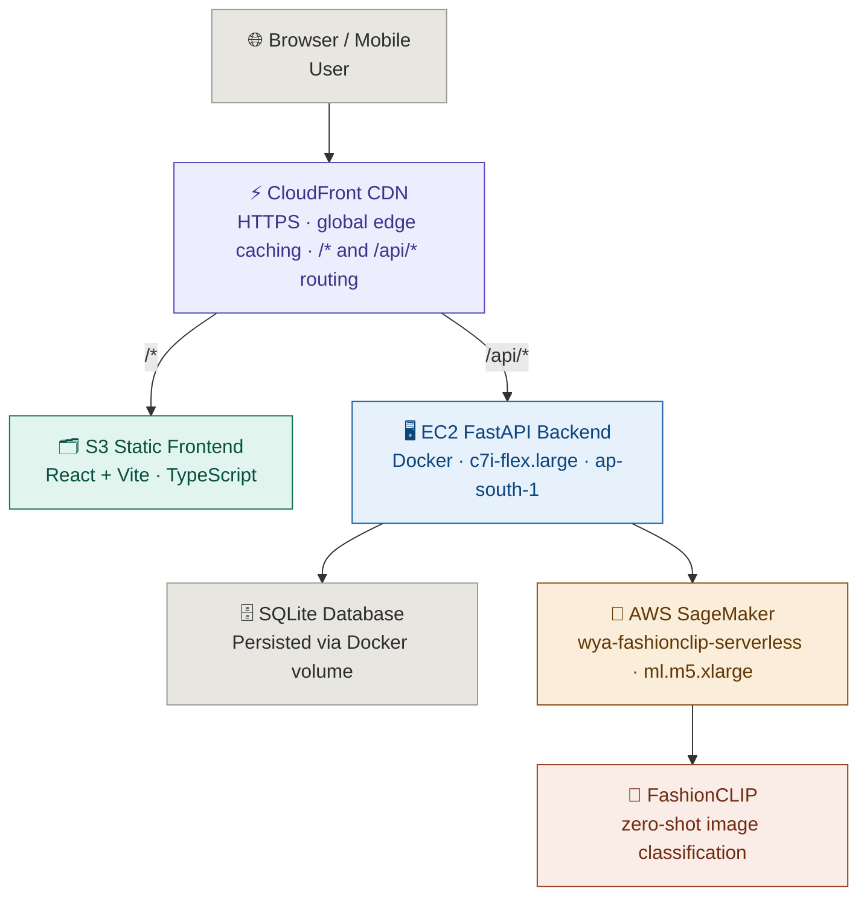
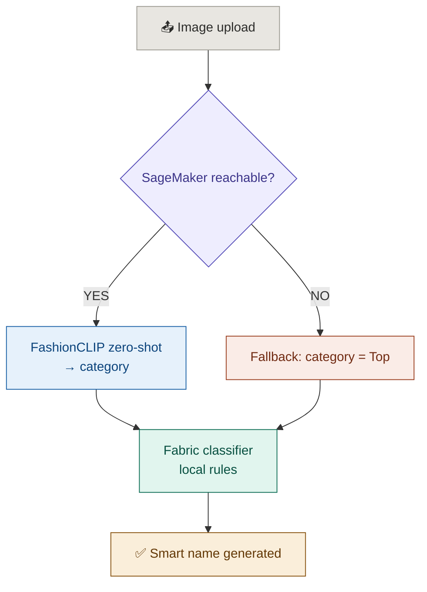

<div align="center">


# WYA — What's Your Aesthetic

**An AI-powered full-stack fashion web app** that helps users discover, analyze, and refine their personal style through computer vision, style profiling, and wardrobe intelligence.

> ⚠️ **Status:** The EC2 backend is currently disabled to pause AWS costs. The frontend is still live on CloudFront, but API features (wardrobe, AI tagging, outfit matching, etc.) are offline. To run the full app, see [Run Locally](#run-locally) or [Docker Deployment](#docker-deployment-ec2).

</div>

---

## Problem Statement

Most people own more clothes than they wear, yet still feel like they have nothing to wear. This paradox stems from three real problems:

**1. No visibility into what you own.**
Wardrobes grow organically over years of impulse buys, gifts, and seasonal purchases. Without a structured view of what exists, people rediscover forgotten items only when physically digging through their closet — or worse, rebuy things they already own.

**2. Personal style is hard to articulate.**
"Aesthetic" is a vague concept. People know what they like when they see it, but struggle to define their own style in a way that makes shopping, outfit building, or wardrobe curation actionable. Existing fashion apps offer generic trend feeds, not personalised style intelligence.

**3. Sustainability is invisible.**
Fast fashion has made it cheap and easy to accumulate clothing, but the environmental cost of a wardrobe is completely opaque to the average consumer. There is no feedback loop between what people buy and the sustainability impact of those choices.

Current tools — Pinterest boards, Instagram saves, shopping wishlists — are passive. They help people collect inspiration but do nothing to connect that inspiration to the clothes already hanging in their wardrobe.

---

## Solution

WYA turns a personal wardrobe into an intelligent, queryable system using computer vision and style profiling.

**Style DNA Quiz.**
An interactive questionnaire maps a user's aesthetic preferences across dimensions like formality, colour palette, era influence, and occasion. The result is a style vector that drives all downstream recommendations — not a generic personality label, but a structured profile the system can reason over.

**AI-powered wardrobe digitisation.**
Users upload garment photos and the pipeline automatically extracts category, dominant colour, secondary colour, fabric type, pattern, texture, and brightness — then generates a descriptive name like "Floral Chiffon Midi Dress" or "Washed Indigo Straight Jeans". No manual tagging required. The two-tier architecture uses AWS SageMaker (FashionCLIP) for zero-shot category classification and a local rule-based fabric classifier for everything else, with a graceful fallback if SageMaker is unreachable.

**Outfit intelligence.**
The AI Outfit Matcher generates outfit combinations from the existing wardrobe using colour harmony rules and the user's style profile — not generic fashion rules, but combinations grounded in what the user actually owns and what their profile says they prefer.

**Closing the sustainability loop.**
The Green Score gives each wardrobe a sustainability rating based on brand scores, fabric composition, and wear frequency. Users can see concretely which items drag their score down and why — turning an abstract environmental concern into a specific, actionable signal.

**Wardrobe gap analysis.**
Rather than pushing users to buy more, the gap analyzer identifies which categories or occasions are underserved in the existing wardrobe — so any new purchases are intentional, not impulsive.

Everything runs on a user's actual wardrobe, not curated editorial content. The system gets more useful the more items are added, creating a feedback loop that rewards engagement with genuine utility.

---

## Architecture



**Deployment**
- Frontend → S3 + CloudFront (HTTPS, CDN cached, global)
- Backend → Docker on EC2 `c7i-flex.large` (ap-south-1), Elastic IP `65.1.104.57` — **currently stopped**
- CI/CD → GitHub Actions (push to `main` → auto build + deploy + CloudFront invalidation)

---

## Features

| Feature | Description |
|---|---|
| 🧬 Style DNA Quiz | Interactive questionnaire that maps your personal aesthetic |
| 👗 Wardrobe / Closet | Upload garments with AI auto-tagging (category, color, fabric, pattern) |
| 🤖 AI Outfit Matcher | Outfit suggestions based on color harmony and your style profile |
| 📈 Style Evolution | Track how your aesthetic changes over time |
| 🌿 Green Score | Sustainability rating for your wardrobe |
| ✨ Aesthetic Aura | Shareable style card generated from your wardrobe |
| ✈️ Vacation Packer | Trip and weather-based outfit curation |
| 🌤️ Weather Styling | Real-time weather-based outfit recommendations |
| 🪄 Background Removal | Clean garment images automatically via `rembg` |
| 🔔 Push Notifications | Style alerts and reminders via VAPID |

---

## AI Pipeline

```
Image upload
  ↓
Background removal  (rembg + OpenCV)
  ↓
Garment mask extraction  (GrabCut / Otsu thresholding)
  ↓
Garment crop + zoom  (removes background noise pre-classification)
  ↓
✅ Zero-shot classification  →  AWS SageMaker (FashionCLIP)
✅ Dominant color extraction  →  KMeans clustering (sklearn)
✅ Secondary color detection  →  largest non-dominant cluster
✅ Texture + brightness analysis  →  OpenCV
✅ Pattern detection  →  striped / floral / geometric / solid (Sobel + Canny)
✅ Fabric inference  →  rule-based classifier (category × color × texture × pattern)
✅ Smart name generation  →  e.g. "Floral Chiffon Midi Dress", "Washed Indigo Jeans"
✅ Style profile vectorization + outfit similarity matching
```

### Garment Auto-Tagging — Two-Tier Architecture

**Tier 1 — AWS SageMaker (FashionCLIP)**
Zero-shot classification with candidate labels. EC2 authenticates via IAM instance profile (no API keys). Returns category (e.g. Dress, Jeans, Watch).

**Tier 2 — Rule-based fabric classifier**
Runs locally on the EC2 container using `category × color × texture × pattern` rules — no additional ML inference needed.



---

## Tech Stack

**Frontend**
- React + TypeScript + Vite
- Deployed on AWS S3 + CloudFront (HTTPS)

**Backend**
- FastAPI (Python)
- SQLite (persisted at `/app/data/wya.db` via Docker volume)
- OpenCV + Pillow + `rembg` for computer vision
- scikit-learn for KMeans color clustering
- slowapi for per-route rate limiting on AI endpoints
- AWS SageMaker for garment classification (FashionCLIP)
- Dockerized, deployed on AWS EC2 (ap-south-1)

**AWS Infrastructure**
- EC2 `c7i-flex.large` (ap-south-1) — Docker backend, Elastic IP `65.1.104.57` — **stopped**
- S3 + CloudFront — static frontend with HTTPS and CDN caching
- CloudFront `/api/*` behavior — routes backend traffic through HTTPS (no mixed content)
- SageMaker endpoint `wya-fashionclip-serverless` on `ml.m5.xlarge`
- IAM role `wya-sagemaker-role` via EC2 instance profile — no API keys needed

---

## Deployment Status

| Component | Status |
|---|---|
| Frontend (S3 + CloudFront) | ✅ Live |
| Backend (Docker on EC2) | ⏸️ Stopped (cost pause) |
| Elastic IP (fixed, survives reboots) | ✅ `65.1.104.57` (reserved) |
| HTTPS end-to-end (no mixed content) | ✅ Via CloudFront |
| Database (SQLite, persistent volume) | ⏸️ Paused with EC2 |
| SageMaker FashionCLIP endpoint | ⏸️ Stopped |
| CI/CD (GitHub Actions) | ✅ Configured |
| Rate limiting (slowapi) | ✅ AI endpoints protected |
| Health checks (`/health`, `/health/ready`) | ✅ Implemented |
| Automated daily backups (S3) | ⏸️ Paused with EC2 |
| Server watchdog (auto-recovery) | ✅ Configured (activates on EC2 start) |

> To bring the backend back online: start the EC2 instance, Docker will auto-restart via `--restart unless-stopped`, and the SageMaker endpoint can be reactivated with `python3 deploy_fashionclip.py`.

---

## Rate Limiting

AI endpoints are protected with [slowapi](https://github.com/laurentS/slowapi) to prevent abuse and control SageMaker inference costs.

| Endpoint | Limit |
|---|---|
| `POST /api/ai/fabric-scan` | 10 / minute |
| `POST /api/ai/outfit-match` | 10 / minute |
| `POST /api/ai/curate-outfits` | 10 / minute |
| `POST /api/ai/gap-analysis` | 10 / minute |
| `POST /api/ai/green-audit` | 20 / minute |

Standard CRUD endpoints (`/api/wardrobe`, `/api/auth`, `/api/outfits`, etc.) are not rate limited.

---

## Run Locally

**Prerequisites:** Node.js 18+, Python 3.10+

**Frontend**
```bash
npm install
npm run dev
```

**Backend**
```bash
pip install -r requirements.txt
cp env.example .env
# Fill in your .env values
uvicorn main:app --reload
```

**Environment Variables**

| Variable | Description |
|---|---|
| `SECRET_KEY` | JWT secret |
| `SAGEMAKER_ENDPOINT` | SageMaker endpoint name (default: `wya-fashionclip-serverless`) |
| `AWS_REGION` | AWS region (default: `ap-south-1`) |
| `WYA_VAPID_PRIVATE_KEY` | Push notification private key |
| `WYA_VAPID_PUBLIC_KEY` | Push notification public key |

---

## Docker Deployment (EC2)

```bash
# Build and run
sudo docker build -t wya-backend .
sudo docker run -d \
  --name wya \
  --restart unless-stopped \
  -p 8000:8000 \
  --env-file .env \
  -e SAGEMAKER_ENDPOINT=wya-fashionclip-serverless \
  -e AWS_REGION=ap-south-1 \
  -v /home/ubuntu/wya-data:/app/data \
  wya-backend

# Logs
sudo docker logs wya -f

# Free disk space after rebuilds
sudo docker system prune -a -f
```

---

## CI/CD (GitHub Actions)

Push to `main` automatically triggers:
1. `deploy-backend` — SSH into EC2, rebuild Docker image, restart container (~2m 30s)
2. `deploy-frontend` — `npm run build` → S3 sync → CloudFront invalidation (~30s)

Workflow file: `.github/workflows/deploy.yml`

---

## SageMaker Endpoint

```bash
source venv/bin/activate
python3 deploy_fashionclip.py
```

**Diagnose SageMaker connectivity:**
```bash
pip3 install boto3 pillow --break-system-packages
python3 Test_sagemaker.py

# Test with a real garment image
python3 Test_sagemaker.py /path/to/garment.jpg
```

---

## Testing

**47 tests** covering auth, wardrobe CRUD, health endpoints, outfit generation, and AI rate limiting.

```bash
pip install pytest httpx
pytest
```

| File | Tests | Coverage |
|---|---|---|
| `test_auth.py` | 15 | Register, login, duplicates, missing fields, token validation |
| `test_wardrobe.py` | 12 | CRUD, auth enforcement, cross-user isolation |
| `test_health.py` | 10 | Liveness, readiness, DB check, build info |
| `test_outfits.py` | 10 | Outfit CRUD, rate limit enforcement (429) |

Tests use a temporary SQLite database — your real database is never touched.

---

## Project Structure

```
WYA-Whats-Your-Aesthetic/
│
├── views/                        # React page components
│   ├── AIMatcher.tsx             # Outfit suggestion UI
│   ├── AestheticAura.tsx         # Shareable style card
│   ├── Closet.tsx                # Wardrobe upload + autotag UI
│   ├── Curate.tsx                # Outfit curation view
│   ├── Dashboard.tsx
│   ├── Evolution.tsx             # Style evolution tracker
│   ├── GreenScore.tsx            # Sustainability score view
│   ├── Login.tsx                 # Auth / login page
│   ├── Profile.tsx
│   ├── ScanLook.tsx              # Scan & identify a look
│   ├── StyleQuiz.tsx             # Aesthetic quiz
│   ├── TheArchive.tsx            # Archived wardrobe items
│   ├── VacationShop.tsx          # Vacation packer / trip curation
│   └── Weather.tsx               # Weather-based outfit view
│
├── routers/                      # FastAPI route modules
│   ├── Recommend_router.py       # /api/recommend — personalised recommendations
│   ├── ai_router.py              # /api/ai — fabric-scan, outfit-match, weather, gap
│   ├── auth_router.py            # /api/auth — login, register
│   ├── health_router.py          # /api/health — liveness, readiness, build info
│   ├── outfit_router.py          # /api/outfits — save, wear tracking, history
│   ├── style_router.py           # /api/style — DNA, aura, evolution, dashboard
│   ├── user_router.py            # /api/user — profile, preferences, notifications
│   └── wardrobe_router.py        # /api/wardrobe — CRUD, remove-bg, archive
│
├── services/                     # Backend + frontend service modules
│   ├── api.ts                    # Frontend API client (TypeScript)
│   ├── brand_auditor.py          # Brand sustainability scoring
│   ├── color_matcher.py          # Color harmony engine
│   ├── computer_vision.py        # Garment detection, masking, color, pattern
│   ├── fabric_classifier.py      # Rule-based fabric inference engine
│   ├── gap_analyzer.py           # Wardrobe gap detection
│   ├── outfit_generator.py       # Outfit + gap analysis
│   ├── style_profile.py          # Style DNA extraction
│   ├── trip_curator.py           # Vacation packing curation
│   └── weather_service.py        # Real-time weather + outfit pairing
│
├── tests/                        # Pytest test suite
│   ├── conftest.py               # Shared fixtures, temp DB, test client
│   ├── test_auth.py
│   ├── test_health.py
│   ├── test_outfits.py
│   └── test_wardrobe.py
│
├── .github/workflows/
│   └── deploy.yml                # CI/CD pipeline
│
├── data/                         # JSON reference data
│   ├── brand_score.json
│   ├── category_map.json
│   ├── color_dictionary.json
│   ├── color_harmony.json
│   ├── fashion_data.json
│   └── weather_codes.json
│
├── ai_model.py                   # AI orchestrator (autotag, suggestions, aura)
├── ai_matcher.py                 # Advanced similarity matching engine
├── auth_utils.py                 # JWT authentication
├── backup.py                     # Automatic daily S3 backup
├── database.py                   # SQLite schema + helpers
├── main.py                       # FastAPI entry point + router registration
├── rate_limiter.py               # slowapi limiter instance
├── schemas.py                    # Pydantic request/response schemas
├── watchdog.py                   # Server watchdog — restarts container if unresponsive
│
├── deploy_fashionclip.py         # SageMaker endpoint deployment script
├── Test_sagemaker.py             # SageMaker connectivity diagnostics
│
├── requirements.txt
├── Dockerfile
├── env.example
└── LICENSE                       # GNU GPL v3.0
```

---

## Future Scope

### Features

| Feature | Why |
|---|---|
| Outfit rating & feedback | Users rate AI outfits so recommendations improve over time |
| Trend detection | Flag wardrobe items that are trending or going out of style |
| Virtual try-on | Overlay clothing on a user photo using AR |
| Similar item shopping | Suggest where to buy something similar when an item runs out |
| Outfit calendar | Plan outfits ahead for the week or upcoming trips |
| Share aesthetic aura card | Post your style card directly to Instagram or WhatsApp |
| React Native app | Proper mobile app — camera access makes garment uploads much easier |
| Barcode scanner | Scan a clothing tag in-store to check if it fits your aesthetic before buying |

### Deployment Roadmap

#### Phase 1 — Harden what's already built

| Task | What it means |
|---|---|
| AWS Secrets Manager | Move `SECRET_KEY` and API keys out of `.env` into AWS-managed storage |
| CloudWatch alerts | Get notified when CPU spikes, memory runs low, or error rate jumps |
| Alembic migrations | Track every database schema change like Git tracks code |
| Staging environment | A second EC2 that mirrors production for pre-deploy testing |

#### Phase 2 — Scale the data layer

| Task | What it means |
|---|---|
| SQLite → RDS Postgres | Handles real concurrent traffic with automatic backups |
| Redis caching | Store wardrobe and style profile data in memory to reduce DB load |
| Celery background jobs | Move slow tasks (SageMaker calls, emails, backups) off the main thread |
| Structured observability | Centralised logs + metrics dashboard |

#### Phase 3 — Only if real users arrive

| Task | What it means |
|---|---|
| ALB + Auto Scaling | Distribute traffic across multiple EC2 instances automatically |
| ECS / Docker orchestration | AWS-managed containers with zero-downtime deploys |
| AWS WAF | Network-level firewall on CloudFront for bot/DDoS protection |
| Blue-green deployments | Zero-downtime deploys via two mirrored environments |
| Multi-region | Add a second AWS region for users outside Mumbai |

---

## License

**Copyright © 2024 Ria S & Mitakshi Sinha**

This program is free software: you can redistribute it and/or modify it under the terms of the GNU General Public License as published by the Free Software Foundation, either version 3 of the License, or (at your option) any later version.

**Full license text:** [GNU GPL v3.0](https://www.gnu.org/licenses/gpl-3.0.en.html)
